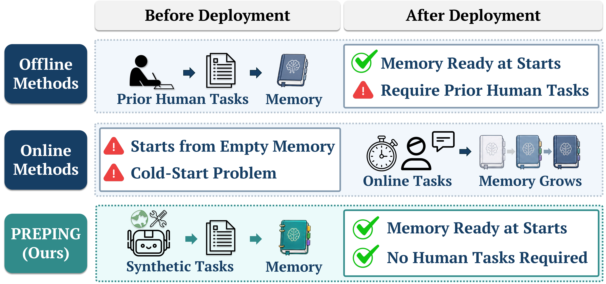
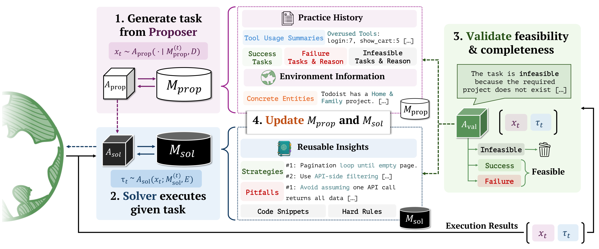

# Preping: Building Agent Memory without Tasks

[](https://dozi01.github.io/preping-project-page/)

Preping is a framework for **pre-task memory construction**: building reusable procedural memory for a tool-using agent before any target-environment task data are available.

Most agent memory pipelines are built either offline from curated task trajectories or online from user-facing interactions. Both settings assume task experience from the target environment. Preping instead prepares memory before deployment by letting the agent generate synthetic practice tasks, execute them in the environment, validate the resulting trajectories, and distill only reliable experience into a playbook-style memory.



Preping targets the cold-start gap that appears when an agent is connected to a new executable environment but has not yet seen any user tasks from that environment. Instead of waiting for deployment-time interactions to accumulate memory, Preping builds broad procedural coverage beforehand through self-generated practice.

## Overview

Preping runs a controlled synthetic-practice loop:

1. **Proposer** generates synthetic task-level objectives from environment documentation and proposer memory.
2. **Solver** executes those tasks in the target environment.
3. **Validator** checks whether each task-trajectory pair is feasible, grounded, and useful for memory construction.
4. **Solver memory** is updated only from validator-approved trajectories.
5. **Proposer memory** records both accepted and rejected attempts so later proposals cover under-practiced tools while avoiding repeated infeasible tasks.

This separation is the main design point. Proposer memory controls **what to practice**, while solver memory stores **what to use at deployment time**.



The construction loop keeps two memory states with different roles. Proposer memory records practice history, validation outcomes, and grounded environment information so the next synthetic tasks become less redundant and more feasible. Solver memory is the deployment-facing playbook, updated only from validator-approved trajectories.

## Repository Layout

- `src/preping/core/preping/`: proposer, validator, proposer memory, validation policy, records, and cycle orchestration.
- `src/preping/core/memory/playbook/`: playbook induction, reflection, curation, retrieval, and storage.
- `src/preping/appworld/`: AppWorld agent, environment wrapper, task generation adapter, memory adapter, and execution utilities.
- `experiments/appworld/`: runnable AppWorld experiment scripts, Makefile helpers, and prompt templates.

The current release focuses on the AppWorld implementation path. The paper evaluates Preping on AppWorld, BFCL v3, and MCP-Universe.

## Installation

```bash
cd preping_submit
conda create -n preping python=3.11 -y
conda activate preping
pip install -e .
```

The code also expects benchmark/provider dependencies that are not vendored in this repository, such as AppWorld and LiteLLM-compatible model backends. Install AppWorld following the benchmark's official setup, and ensure its data path is available to the `appworld` Python package.

Set the API key for the model provider you use:

```bash
export DEEPSEEK_API_KEY=...
# or
export OPENAI_API_KEY=...
# or
export OPENROUTER_API_KEY=...
```

For AppWorld API documentation, the code first uses the installed AppWorld package. If needed, point directly to the docs directory:

```bash
export APPWORLD_API_DOCS_DIR=/path/to/appworld/data/api_docs/standard
```

## Quick Start: AppWorld

The AppWorld helpers live in `experiments/appworld`.

```bash
cd experiments/appworld
make help
```

Run the base AppWorld agent without constructed memory:

```bash
make run SPLIT=test_normal MODEL=deepseek/deepseek-chat WORKERS=20 TAG=base
```

Construct a Preping playbook through synthetic practice:

```bash
make cycle \
  MODEL=deepseek/deepseek-chat \
  MAX_CYCLES=10 \
  TASKS_PER_CYCLE=10 \
  RUNS_PER_TASK=1 \
  WORKERS=20 \
  TAG=preping
```

This writes outputs under `experiments/appworld/outputs/...`, including:

- `playbook.json`: deployment-facing solver memory.
- `proposer_memory.json`: construction-time proposer memory.
- `all_tasks.json`: generated synthetic tasks and construction metadata.
- `experiment_summary.json`: run configuration, costs, validation status, and memory statistics.

Evaluate AppWorld with an existing playbook:

```bash
make run-pb \
  PB_FILE=outputs/path/to/playbook.json \
  SPLIT=test_normal \
  MODEL=deepseek/deepseek-chat \
  WORKERS=20 \
  TAG=preping_eval
```

Run construction and evaluate the final playbook in one command:

```bash
make cycle-eval \
  MODEL=deepseek/deepseek-chat \
  MAX_CYCLES=10 \
  TASKS_PER_CYCLE=10 \
  WORKERS=20 \
  SPLIT=test_normal \
  TAG=preping_cycle_eval
```

## Main CLI Entry Points

Run a Preping construction cycle:

```bash
python run_trajectory_cycle.py \
  --max_cycles 10 \
  --tasks_per_cycle 10 \
  --runs_per_task 1 \
  --num_workers 20 \
  --global_model_name deepseek/deepseek-chat \
  --tag preping \
  --build_playbook \
  --validate_trajectory \
  --use_proposer_memory \
  --use_environment_info \
  --memory_guided_generation
```

Evaluate a saved playbook:

```bash
python run_all_parallel.py \
  --split test_normal \
  --global_model_name deepseek/deepseek-chat \
  --memory_type playbook \
  --memory_path outputs/path/to/playbook.json \
  --num_workers 20 \
  --tag preping_eval
```

Run task-informed sequential adaptation baselines:

```bash
make adapt MODE=offline SPLIT=train MODEL=deepseek/deepseek-chat TAG=ace_offline
make adapt MODE=online SPLIT=test_normal MODEL=deepseek/deepseek-chat TAG=ace_online
```

Build a documentation-only direct-memory baseline:

```bash
make direct-memory MEMORY_MODEL=deepseek/deepseek-chat
```

## Configuration Notes

- `--global_model_name` sets the same model for the solver, memory updater, and task manager.
- `--agent_model_name`, `--memory_model_name`, and `--task_manager_model_name` can override components separately.
- `--validate_trajectory` enables validator-gated memory admission.
- `--use_proposer_memory` conditions future synthetic tasks on construction history.
- `--use_environment_info` summarizes grounded environment facts discovered during execution.
- `--task_embedding_model` and `--task_embedding_base_url` enable semantic de-duplication for generated tasks.

The Makefile defaults to a local embedding endpoint:

```bash
TASK_EMBEDDING_MODEL=Qwen/Qwen3-Embedding-0.6B
TASK_EMBEDDING_BASE_URL=http://localhost:8201/v1
```

Change or unset these values if you are not running a local embedding server.

## Paper Summary

Preping studies whether an agent can build procedural memory before observing target-environment tasks. The method treats memory construction as a control problem over both **practice selection** and **memory admission**. In the paper, Preping improves over no-memory baselines across AppWorld, BFCL v3, and MCP-Universe, remains competitive with task-informed memory methods, and reduces deployment-time memory-update cost relative to online memory construction.

## Citation

```bibtex
@article{preping2026,
  title={Preping: Building Agent Memory without Tasks},
  author={Anonymous Authors},
  year={2026}
}
```
